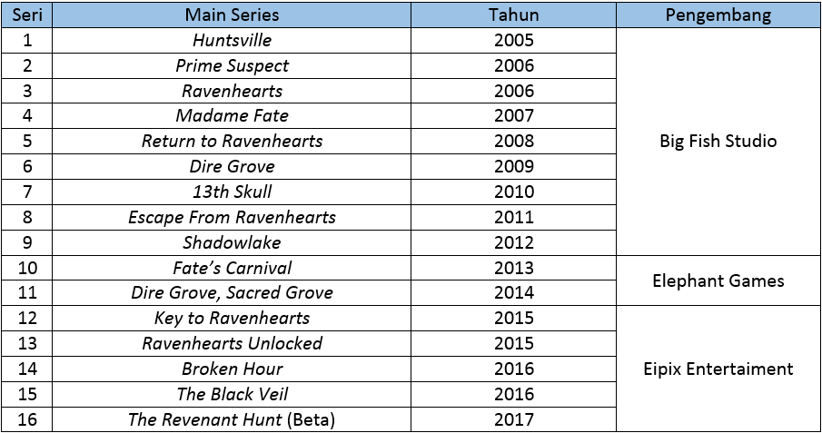
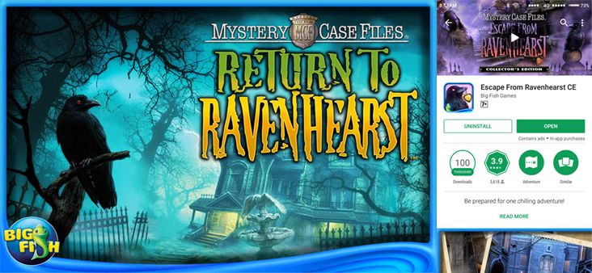
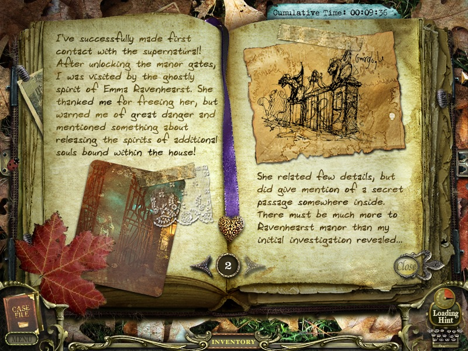

<body>
   <h1>Review Game: <i>Mystery Case Files</i></h1>
   
Anggraeni Damayanti - 3145143624

   
Ilmu Komputer 2014

   

   <h4>
Bicara soal game terutama untuk category <i>hidden object</i>, mungkin tidak akan asing ketika mendengar game MCF atau yang biasa disebut <i>Mystery Case Files</i> bagi kalangan gamers. Beberapa bulan lalu sekitar July 2017, <i>Mystery Case Files</i> kembali hadir dengan series ke-16 yang masih berupa versi beta. Big Fish Studio dulunya merupakan pengembang <i>Mystery Case Files</i> seri-1 (2005) sampai dengan seri-9 (2012), sampai pada akhirnya dipindah tangankan ke Elephant Game. Elephant Game sendiri mulai mengembangkan game ini pada tahun 2013 dan 2014 dengan sebagai 2 seri lanjutan <i>Mystery Case Files</i> dari seri sebelumnya. Kemudian pada tahun 2015 sampai dengan sekarang <i>Mystery Case Files</i> dikembangkan oleh developer terbaru yaitu Eipix Entertaiment yang juga merupakan pengembang seri ke-16.
</h4> 
   
  

  <h4>
Dua series yang akan kita review dalam artikel ini adalah seri ke-5: <i>Return to Ravenhearts</i> untuk komputer atau laptop dan seri ke-8: <i>Escape From Ravenhearts</i> untuk android yang dikembangkan oleh Big Fish Studio. Big Fish Studio mengeluarkan 6 seri untuk game ini di android, beberapa berbayar dan beberapa lainnya gratis. Bagaimana gameplay dan impress kedua game ini? Apakah ada perbandingan versi komputer dan versi android?
</h4> 
  
  

  <h4>
<i>Mystery Case Files: Return to Ravenhearts</i> ini merupakan game lanjutan dari seri <i>Mystery Case Files: Ravenhearts</i>. Jika Anda pernah bermain seri <i>Ravenhearts</i>, Anda pasti tau jalan cerita game tersebut. <i>Ravenhearts</i> sendiri berkisah tentang suatu rumor seputar <i>Ravenhearts Manor</i> di <i>Blackpool</i> yang berhantu, sehingga memutuskan ratu inggris untuk meminta Anda memecahkan mistery hantu di <i>Ravenhearts Manor</i> dan membebaskan roh Emma yang merupakan hantu tersebut. Lalu, bagaimana jalan cerita untuk seri-5 <i>Return to Ravenhearst</i>?. 
  
Sesuai dengan judulnya <i>Return to Ravenhearst<i>, Anda akan diajak kembali ke <i>Ravenhearst Manor</i> untuk menyelamatkan nyawa lain, Rose Somerset. Siapa Rose Somerset dan kenapa Emma dan Rose meninggal?
</h4>
<h4>
Jika saya jelaskan secara detail, mungkin satu artikel ini tidak akan cukup untuk menjelaskan. Karena jujur, story telling yang dibuat oleh Big Fish Studio untuk game series ini benar-benar kompleks dan banyak karakter dalam game ini. Belum lagi series ini masih berlanjut sampai pada seri ke-13. Sehingga jika saya perlu memberi ranting untuk story game ini maka saya akan memberikan 4 bintang dari 5 bintang. Jalan ceritanya yang benar-benar menarik dan misterius memikat saya untuk tetap bermain karena penasaran akan akhir game ini. Jika Anda ingin benar-benar mengetahui jalan cerita semua seri game ini, Anda bisa mendatangi situs <a href="https://en.wikipedia.org/wiki/Mystery_Case_Files">Mystery Case Files - Wikipedia</a>.
</h4> 

</body>
