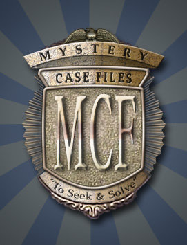

<body>
   <h1>Review Game: <i>Mystery Case Files</i></h1> 
   
Anggraeni Damayanti - 3145143624

   
Ilmu Komputer 2014

   

   <h4>
Bicara soal game terutama untuk kategori <i>hidden object</i>, mungkin tidak akan asing ketika mendengar game MCF atau yang biasa disebut <i>Mystery Case Files</i> bagi kalangan gamers. Beberapa bulan lalu sekitar July 2017, <i>Mystery Case Files</i> kembali hadir dengan seri ke-16 yang masih berupa versi beta. <i>Big Fish Studio</i> dulunya merupakan pengembang <i>Mystery Case Files</i> seri-1 (2005) sampai dengan seri-9 (2012), sampai pada akhirnya dipindah tangankan ke <i>Elephant Game</i>. <i>Elephant Game</i> sendiri mulai mengembangkan game ini pada tahun 2013 dan 2014 dengan 2 seri lanjutan <i>Mystery Case Files</i> dari seri sebelumnya. Kemudian pada tahun 2015 sampai dengan sekarang <i>Mystery Case Files</i> dikembangkan oleh developer terbaru yaitu <i>Eipix Entertaiment</i> yang juga merupakan pengembang seri ke-16.
</h4>
  

 
  <h4>
Dua seri yang akan saya review dalam artikel ini adalah seri ke-5: <i>Return to Ravenhearts</i> untuk komputer atau laptop dan seri ke-8: <i>Escape From Ravenhearts</i> untuk Android yang dikembangkan oleh <i>Big Fish Studio</i>. <i>Big Fish Studio</i> mengeluarkan 6 seri untuk game ini di Android, beberapa berbayar dan beberapa lainnya gratis. Bagaimana gameplay dan impress kedua game ini? Apakah ada perbandingan versi komputer dan versi Android ?
</h4>
  

 
  <h4>
<i>Mystery Case Files: Return to Ravenhearts</i> ini merupakan game lanjutan dari seri <i>Mystery Case Files: Ravenhearts</i>. Jika Anda pernah bermain seri <i>Ravenhearts</i>, Anda pasti tau jalan cerita game tersebut. <i>Ravenhearts</i> sendiri berkisah tentang suatu rumor seputar <i>Ravenhearts Manor</i> di <i>Blackpool</i> yang berhantu, sehingga memutuskan ratu inggris untuk meminta Anda memecahkan misteri hantu di <i>Ravenhearts Manor</i> dan membebaskan roh Emma yang merupakan hantu tersebut. Lalu, bagaimana jalan cerita untuk seri-5 <i>Return to Ravenhearst</i> ?.
</h4>
   <h4>
Sesuai dengan judulnya <i>Return to Ravenhearst</i>, Anda akan diajak kembali ke <i>Ravenhearst Manor</i> untuk menyelamatkan nyawa lain, Rose Somerset. Siapa Rose Somerset dan kenapa Emma serta Rose meninggal ?
</h4>  
<h4>
Jika saya jelaskan secara detail, mungkin satu artikel ini tidak akan cukup untuk menjelaskan. Karena jujur, <i>story telling</i> yang dibuat oleh <i>Big Fish Studio</i> benar-benar kompleks dan banyak karakter dalam game ini. Belum lagi seri ini masih berlanjut sampai pada seri ke-13. Sehingga jika saya perlu memberi ranting untuk jalan cerita game ini maka saya akan memberikan 4 bintang dari 5 bintang. Jalan ceritanya yang benar-benar menarik dan misterius memikat saya untuk tetap bermain karena penasaran akan akhir game ini. Jika Anda ingin benar-benar mengetahui jalan cerita semua seri game ini, Anda bisa mendatangi situs <a href="https://en.wikipedia.org/wiki/Mystery_Case_Files">Mystery Case Files - Wikipedia</a>.
</h4>

 
<h4>
Desain grafis yang terasa HD, animasi dan background suara yang mendukung genre horror game ini benar-benar menambah ketertarikan saya. Jadi, saya sarankan bagi yang takut melihat suasana ruangan remang-remang atau munculnya penampakan untuk tidak memainkan game ini. Sehingga <i>target audiences</i> sendiri tertuju kepada orang dewasa.
</h4>

 
<h4>
Soal permainan, seri ini sama dengan seri lainya yang berkategori <i>hidden object</i>. Anda akan diajak untuk mencari beberapa benda yang ada pada daftar di suatu lokasi. Benda-benda tersebut biasanya mengecoh, terkadang bentuknya punya khas lain atau terkadang tertumpuk sehingga hanya terlihat sedikit bagian dari benda tersebut. Bagi saya pribadi, mencari benda-benda tersebut benar-benar butuh ketelitian bahkan kosa kata yang digunakan dalam daftar benda tersebut merupakan kosa kata yang jarang kita temui. Sisi baiknya kita dapat mencari tau dan menambah pembedaharaan kata bahasa inggris kita.
</h4>

 
<h4>
Selain <i>hidden object</i> terdapat pula game puzzle berupa logika yang biasanya sangat susah untuk dipecahkan. Maka dari itu setiap series dari <i>Mystery Case Files</i> juga ada yang diliris dengan <i>Collector’s Edition (CE)</i>, dimana player mendapatkan juga paduan strategi. Bagaimana dengan versi Android ?
</h4>

 
<h4>
<i>Mystery Case Files</i> untuk game Android tidak dirilis semua seri, hanya 6 yang dikeluarkan oleh <i>Big Fish Studio</i>. Seri yang tak berbayar adalah <i>Escape from Ravenhearts (CE), Madame Fate, Unlocked,</i> dan <i>Dire Grove Sacred Grove</i>. Untuk review game Android, saya menggunakan seri <i>Escape from Ravenhearts (CE)</i>. Karena game ini merupakan game tidak berbayar maka permainannya tidak akan penuh atau full game. Game ini masih perlu dibeli jika ingin bermain secara full dengan harga Rp 40.000. Meskipun game yang saya gunakan tidak berbayar, namun game ini dilengkapi dengan <i>strategy guide</i>.
</h4>
<h4>
Bicara game ini tanpa melihat harga, ternyata tampilan <i>Escape from Ravenhearts (CE)</i> hampir sama dengan tampilan game <i>Mystery Case Files</i> lainnya secara umum. Grafisnya bisa dikatakan bagus untuk sebuah <i>mobile device</i> Android. Sementara untuk <i>story telling</i>-nya dan permainannya juga tidak jauh berbeda dengan versi windows untuk komputer atau laptop yang saya lihat di video trailer atau video reviewnya. Cerita <i>Escape from Ravenhearts (CE)</i> sendiri masih merupakan lanjutan dari <i>Ravenhearts Manor</i>, tidak heran kalau diawal anda akan diajak kembali menuju gerbang <i>Ravenhearts Manor</i> dan bertemu dengan roh Emma.
</h4>

 
<h4>
Permainan <i>Escape from Ravenhearts (CE)</i> sedikit berbeda dengan seri sebelumnya. Ketika <i>hidden object</i>, Anda tidak akan mencari benda berdasarkan daftar benda. Tetapi, benda yang Anda cari merupakan benda-benda tersembunyi yang dapat berubah-rubah. Meskipun grafisnya bisa dibilang HD untuk <i>mobile device</i>, tapi soal resolusi game ini masih kurang. Jika Anda sedang berusaha mencari benda di banyak tumpukan benda dan ternyata terlihat kecil, Anda bisa zoom layar permainan. Sayangnya, ketika diperbesar benda tersebut malah menjadi blur. Kemudian mengenai loading screen yang kadang cukup memakan waktu.
</h4>

 
<h4>
<i>Overall</i>, soal kepuasan hati. Saya sendiri lebih suka memainkan game ini lewat laptop ketimbang handphone Android. Karena tampilan versi Android menyusahkan saya untuk mencari benda secara detail serta loading screen yang lama. Sementara soal game play sendiri saya lebih tertarik pada pencarian berdasarkan daftar seperti <i>return to ravenhearts</i> dan seri sebelumnya dibanding dengan seri <i>escape from ravenhearts</i>. Game <i>mystery case files</i> untuk pc atau laptop windows tersedia berbayar, meski begitu kita tidak perlu merasa sia-sia membeli game ini. <i>Big Fish Studio</i> benar-benar bagus dalam mengembangkan game ini, mereka mengumpulkan hasil survey dan melanjutkan seri selanjutnya. Sama seperti seri ke-16 yang dikeluarkan oleh <i>Eipix Entertaiment</i>. Dari survey tersebut mereka kembangkan seri selanjutnya dan promosikan melalui trailer yang bagi saya trailernya selalu menarik. Dimulai dengan video sebuah berita, rekaman empat orang pelajar yang hilang, gambaran jalan cerita, dan aura mistik yang ditampilkan. Dari trailer saja <i>Mystery Case Files</i> bisa menarik perhatian banyak orang, terutama orang-orang yang menyukai game puzzle jenis ini dan bergenre horror. Game ini benar-benar cocok untuk mengasah logika otak dan pembendaharaan bahasa inggris.
</h4>
<h4>
Demikian ulasan saya untuk game Mystery Case Files ini, semoga review ini bisa menjadi referensi Anda mengenai game <i>hidden object</i> seperti <i>Mystery Case Files</i>.
</h4>

</body>
